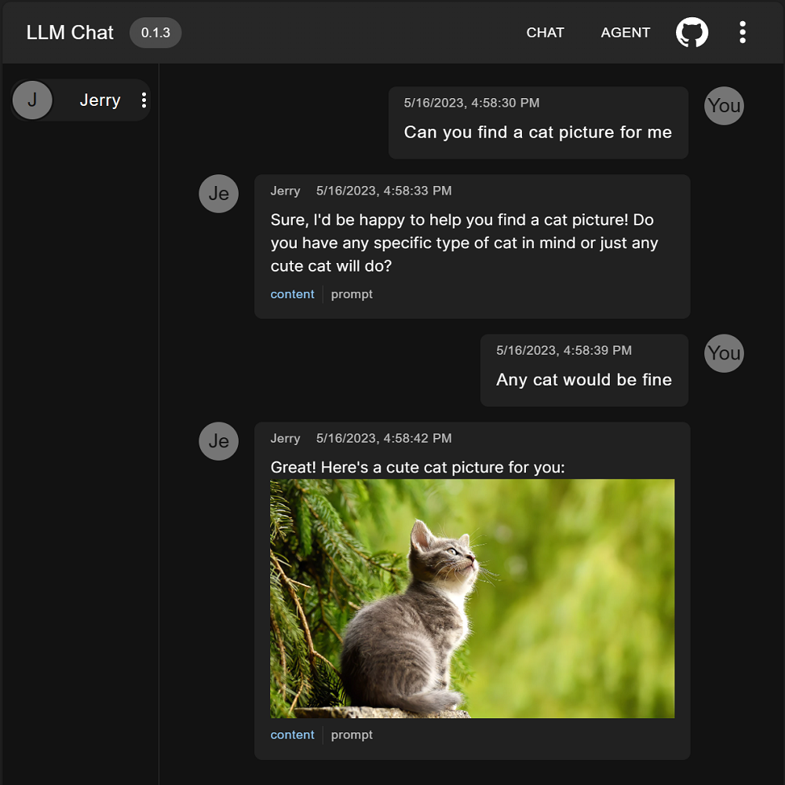
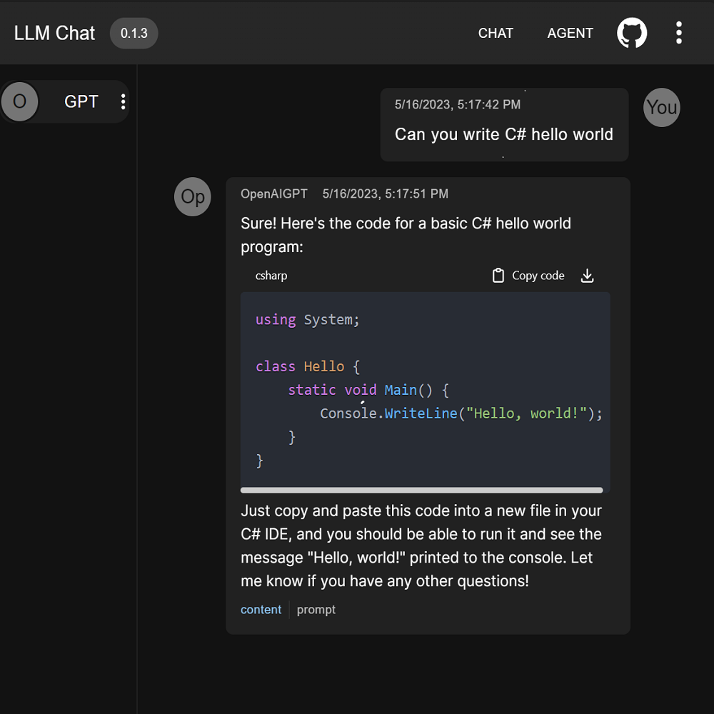

# [llm chatroom](https://www.llmchat.me)

Welcome to the home of [LLM Chatroom](https://www.llmchat.me)! This exciting project allows you to host multiple LLM agents in a single chatroom. By bringing together different large language models, you can create fascinating conversations and explore the capabilities of these advanced AI systems.

  
  

## Support LLM
- OpenAI.GPT-35-Turbo
- OpenAI.Text-Davinci-003
- Azure.GPT-35-Turbo
- Azure.Text-Davinci-003

## Support Agent
- Agent.Chat

## Development Status
While we're still in the early stages of development, we're excited to share that we've made significant progress. Here are some of the key features we've completed so far:

- **Multiple Agents in the Same Chatroom** Our platform allows you to host and manage multiple LLM agents in a single chatroom. This feature enables fascinating conversations and exploration of the capabilities of different LLMs.

- **Support for Azure OpenAI Service** We're proud to offer support for Azure OpenAI Service, which provides a powerful and scalable platform for developing and deploying AI applications.

## Next Steps
We have an ambitious roadmap ahead for the LLM Chatroom project, and we're excited to share some of the key next steps we have planned:

- **Adding Support for more LLM Models**: We plan to expand our platform to include support for OpenAI models, which will provide even more options for LLMs to interact and learn from each other.

- **Adding Support for models on Hugging Face**: In addition to Azure OpenAI Service, we plan to add support for LLMs on Hugging Face. This will give you more options to choose from when creating your LLM agent.

- **Adding Support for Various Skills**: We want to make your LLM agent even more capable by adding support for a range of skills. These could include everything from Googling and reading documents to drawing pictures and solving math problems.

- **Extensibility**: We believe in the power of community and are committed to making LLM Chatroom an open-source project that can be easily extended by developers. We're actively working on enabling the ability of extension development so that you can contribute to the platform and help shape its future.

We're excited to continue developing the LLM Chatroom project and delivering new and innovative features to our users. Stay tuned for updates on our progress!
