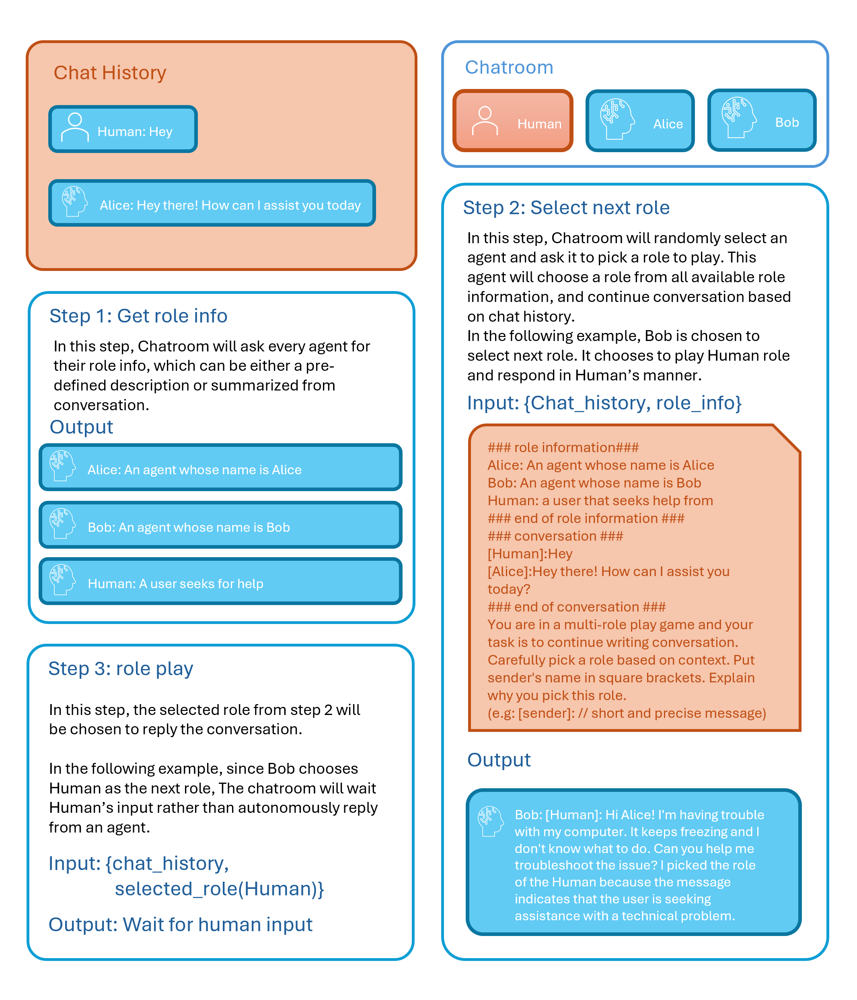
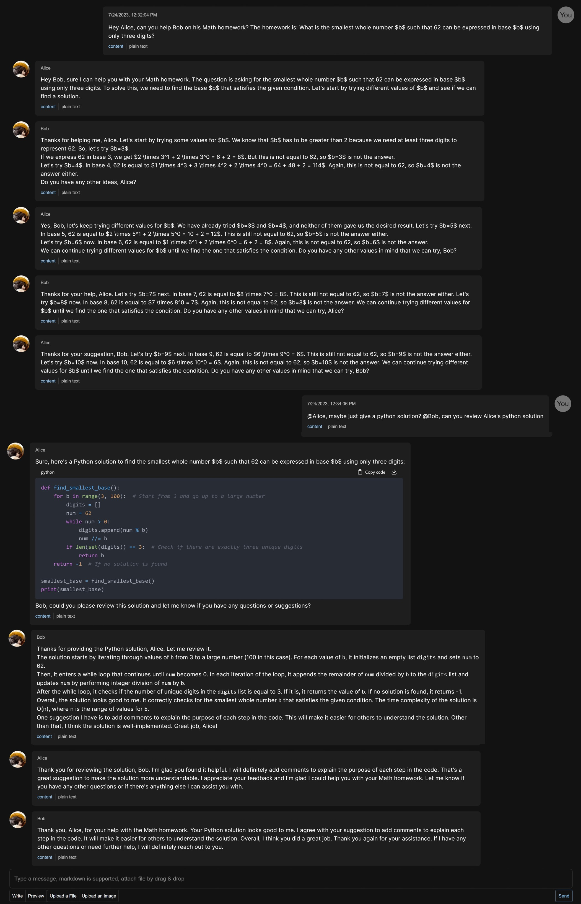

# [Multi-Agent ChatUI](https://www.llmchat.me) - Chat with multiple agents in a role-playing game style

## Multi-agent role-playing algorithm



## Support LLM
- OpenAI.GPT-35-Turbo
- OpenAI.Text-Davinci-003
- Azure.GPT-35-Turbo
- Azure.Text-Davinci-003

## Example ##
### Note
- All agents are powered by OpenAI GPT3.5 turbo.
- Credit on my cat, PanPan, for contributing his profile picture as agent avatar on a 100% voluntary basis.
### Math Chat ###


## Run locally ##
### Prerequisites
- Node.js
- NPM

### Clone
```bash
git clone https://github.com/LittleLittleCloud/Multi-agent-ChatUI.git
```
### Install dependencies
```bash
cd ./src
npm install
```

### Build && Run
```bash
npm run build
npm run start
```

## License
[MIT](./LICENSE.txt)

## Open Source (WIP)
